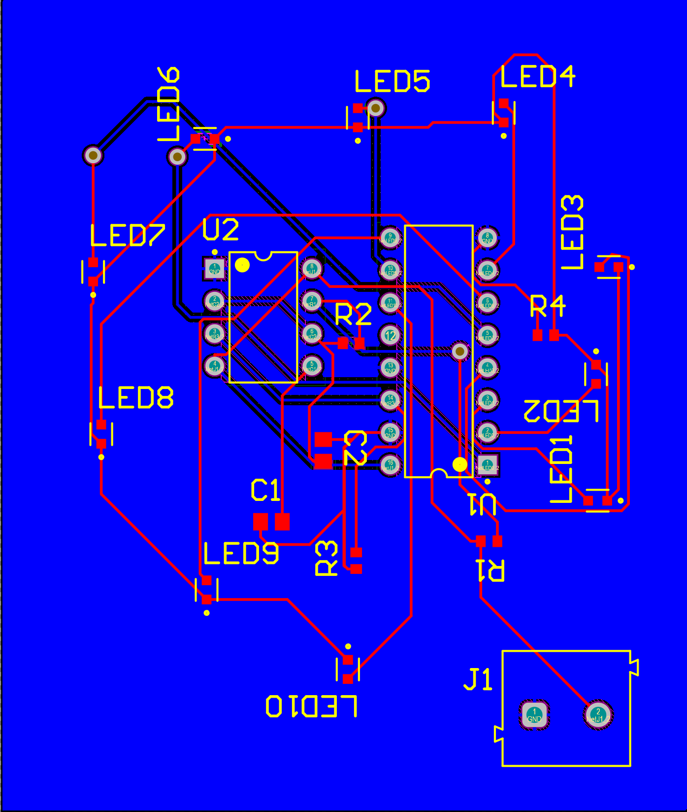
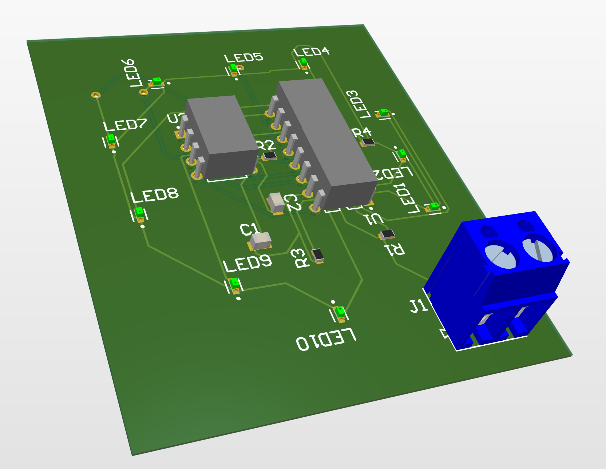
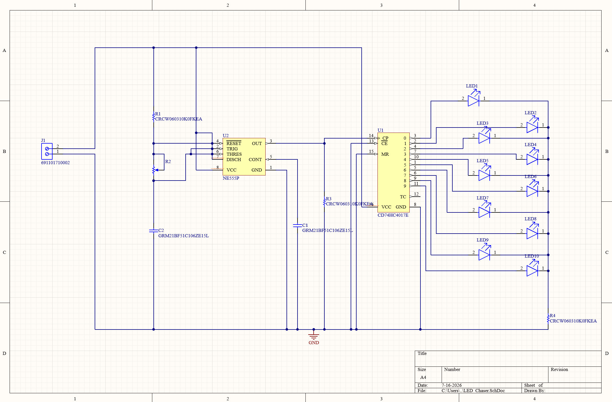
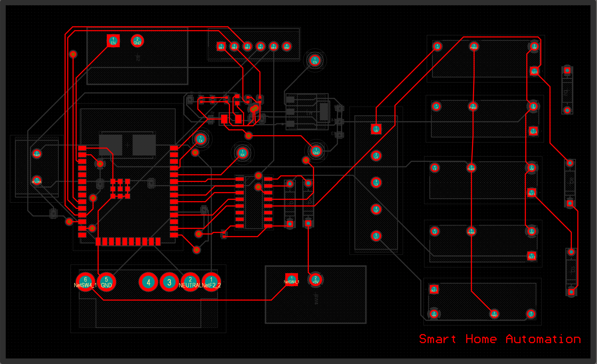
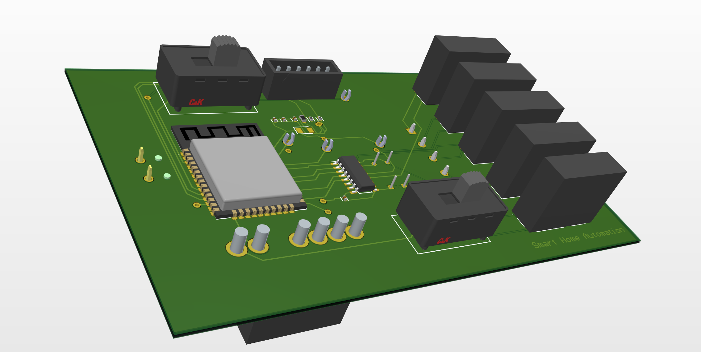
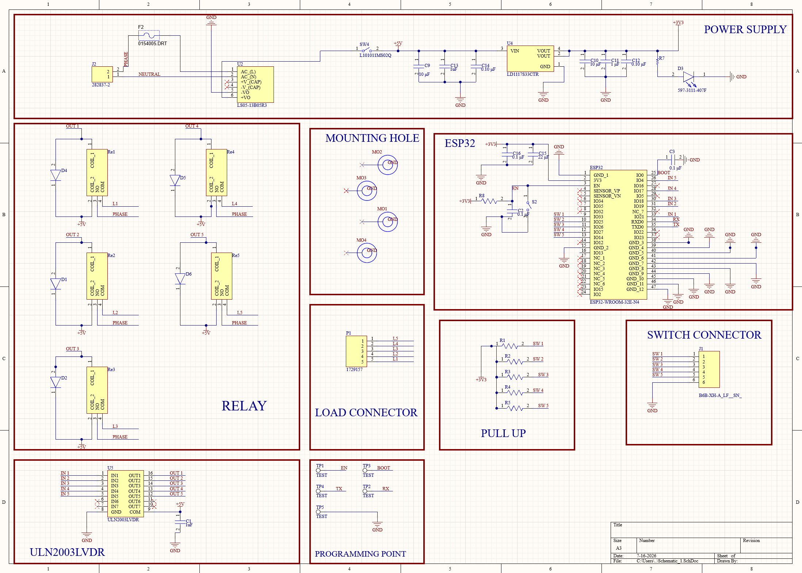
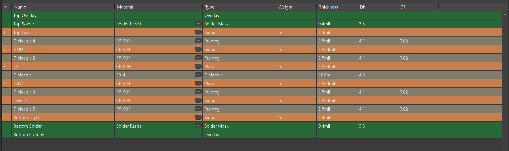

# PCB Designing Using Altium Designer

Mini Project - I, B.E. Electronics and Communication Engineering, Vasavi College of Engineering (Autonomous), Hyderabad (2024-2025).

Two PCB designs built end-to-end in Altium Designer - schematic capture, footprint assignment, routing, DRC/ERC, Gerbers, and 3D views - covering both single-layer and multi-layer workflows.

Full write-up: [`docs/Project_Report.pdf`](docs/Project_Report.pdf) | Slides: [`docs/Project_Presentation.pptx`](docs/Project_Presentation.pptx)

---

## 1. Single-Layer LED Chaser PCB

A 555-timer-based LED chaser: the 555 runs in astable mode to generate clock pulses, which drive a decade counter that lights 10 LEDs one at a time in sequence, resetting and repeating once the last LED fires. Each LED has its own current-limiting resistor.

**Components:** 555 Timer IC, decade counter IC, 10x LEDs, resistors, capacitors, 2-pin power connector.

**Design flow:** schematic capture -> footprint creation -> auto-routing (single-layer, low complexity) -> DRC -> simulated in Proteus to confirm the chase sequence -> Gerber generation.

| | |
|---|---|
| Top layer |  |
| 3D view |  |
| Schematic |  |

**Files:** [Schematic](Single-Layer-LED-Chaser/Schematics/LED_Chaser.SchDoc) - [PCB](Single-Layer-LED-Chaser/PCB) - [BOM](Single-Layer-LED-Chaser/Outputs/BOM) - [Gerbers](Single-Layer-LED-Chaser/Outputs/Gerber) - [Reports](Single-Layer-LED-Chaser/Outputs/Reports) (schematic/PCB PDFs, DRC, drill report)

---

## 2. Smart Home Automation PCB (Multi-Layer)

An ESP32-based home automation controller: the ESP32 connects over Wi-Fi to a mobile app/web interface, and drives relay modules to switch AC loads, with manual switches available for physical control alongside the app.

**Components:** ESP32-WROOM-32, relay modules, HLK-PM03 (AC-to-3.3V DC) module, bridge rectifier, resistors, capacitors.

**Stack-up (6 layers):**

| Layer | Purpose |
|---|---|
| Top | Components + signals |
| Inner 1 | Signal + ground |
| Inner 2 | 5V power plane |
| Inner 3 | 3.3V power plane |
| Inner 4 | Signal routing |
| Bottom | Components + signals |

Dedicated 5V/3.3V planes isolate the two supplies, cut noise/ripple, act as distributed capacitance against high-frequency switching noise, and give more room for controlled-impedance routing. The ESP32 and relays sit on the top layer for Wi-Fi performance, thermal separation from AC loads, and easy access for programming. Routing was done manually (rather than auto-routed) to preserve signal integrity across the plane stack.

| | |
|---|---|
| Top layer |  |
| 3D view |  |
| Schematic |  |
| Layer stack |  |

**Files:** [Schematics](Smart-Home-Control-PCB/Schematics) - [PCB](Smart-Home-Control-PCB/PCB) - [BOM](Smart-Home-Control-PCB/Bill_of_Materials) - [Gerbers](Smart-Home-Control-PCB/Project/Project%20Outputs%20for%20Smart_Home_Control) - [DRC report](Smart-Home-Control-PCB/Outputs/Reports/DRC_Report.pdf)

---

## Verification

Both boards were checked with ERC, DRC, netlist verification, 3D clearance checks, and BOM verification before generating manufacturing outputs (Gerbers, NC drill files, BOM, schematics, PCB layouts, 3D views).

## Tools

Altium Designer, Proteus (LED chaser simulation), Altium CAMtastic, Altium Layer Stack Manager.

## Repository Structure

```
Altium-PCB-Designs
├── Single-Layer-LED-Chaser
│   ├── Schematics
│   ├── PCB
│   ├── Outputs        (BOM, Gerbers, Reports)
│   ├── Libraries
│   └── assets
├── Smart-Home-Control-PCB
│   ├── Schematics
│   ├── PCB
│   ├── Project         (project file + Gerber outputs)
│   ├── Outputs          (reports)
│   ├── Bill_of_Materials
│   └── assets
└── docs                (project report + presentations)
```

## Authors

B. Praneeth Reddy, G. Rohit Reddy, C. Vivek - ECE Department
