<div align="center">

# PCB Designing Using Altium Designer

</div>

---

## About

Two PCB designs built end-to-end in Altium Designer — schematic capture, footprint assignment, auto/manual routing, ERC/DRC, Gerber generation, and 3D visualization — covering both a beginner single-layer flow and a production-style multi-layer flow:

1. **Single-Layer LED Chaser PCB** — a 555-timer astable circuit driving a decade counter to chase 10 LEDs.
2. **Smart Home Automation PCB (Multi-Layer)** — an ESP32-based, 6-layer relay-control board for IoT home automation.

📄 [`docs/Project_Report.pdf`](docs/Project_Report.pdf) — full written report
📊 [`docs/Project_Presentation.pptx`](docs/Project_Presentation.pptx) · [`docs/Project_Presentation_1.pptx`](docs/Project_Presentation_1.pptx) — presentation slides

---

## Repository Structure

```
Altium-PCB-Designs
├── Single-Layer-LED-Chaser
│   ├── Schematics/            LED_Chaser.SchDoc
│   ├── PCB/                   LED_Chaser.PcbDoc
│   ├── Libraries/              PcbLib1.PcbLib, Schlib3.SchLib
│   ├── Outputs/
│   │   ├── BOM/                LED_Chaser_BOM.BomDoc
│   │   ├── Gerber/             Full Gerber + drill file set
│   │   └── Reports/            Schematic/PCB PDFs, DRC report, drill report
│   ├── Project Outputs for LED_Chaser/   Raw CAM output (Gerbers, drill, DRC)
│   ├── LED_Chaser.PrjPcb       Altium project file
│   ├── LED_Chaser.OutJob       CAM output job
│   └── assets/images/          Renders used in this README
│
├── Smart-Home-Control-PCB
│   ├── Schematics/             Schematic.SchDoc, Schematic_1.SchDoc, ForEK1/2.SchDoc
│   ├── PCB/                    PCB.PcbDoc
│   ├── Bill_of_Materials/      Smart_Home_Control_BOM.BomDoc / .xlsx / .pdf
│   ├── Project/
│   │   ├── Smart_Home_Control.PrjPcb
│   │   ├── Smart_Home_Control.OutJob
│   │   └── Project Outputs for Smart_Home_Control/   Full Gerber + drill set, DRC
│   ├── Outputs/Reports/        Status report, DRC_Report.pdf
│   └── assets/images/          Renders used in this README
│
├── docs/
│   ├── Project_Report.pdf
│   ├── Project_Presentation.pptx
│   └── Project_Presentation_1.pptx
│
└── .gitignore
```

---

## 1. Single-Layer LED Chaser PCB

A 555-timer-based LED chaser: the 555 runs in astable mode to generate continuous clock pulses, which drive a decade counter that switches 10 LEDs on one at a time in sequence — each LED "chasing" the one before it. When the last LED lights up, the counter resets and the sequence repeats. Each LED has its own current-limiting resistor, and power comes in through a 2-pin connector.

**Components:** 555 Timer IC · Decade Counter IC · 10× LEDs (LED1–LED10) · resistors · capacitors · 2-pin power connector

**Design flow:** schematic capture in the component library (some parts sourced externally where not in Altium's library) → footprint creation → **auto-routing** (simple, single-layer circuit) → DRC → simulated in **Proteus** to confirm the LEDs actually chase and reset correctly → Gerber generation for fabrication.

<table>
<tr>
<td><b>Schematic</b><br></td>
<td><b>Top Copper Layer</b><br></td>
</tr>
<tr>
<td><b>Bottom Layer</b><br>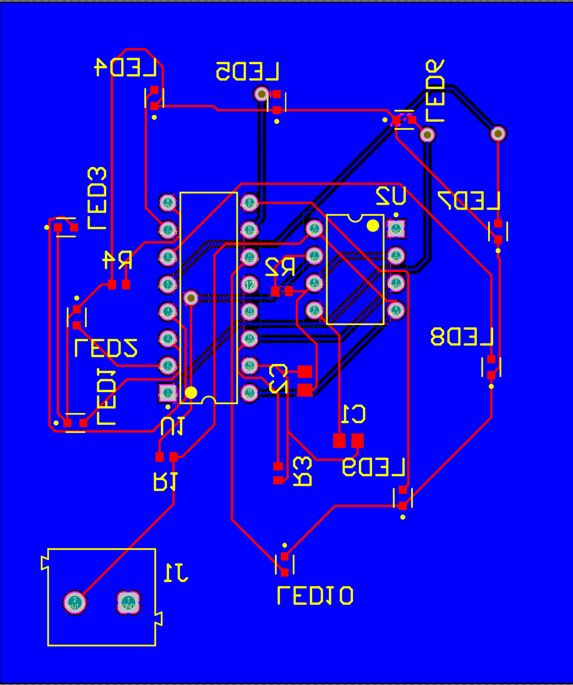</td>
<td><b>3D Isometric View</b><br></td>
</tr>
<tr>
<td><b>3D Top</b><br>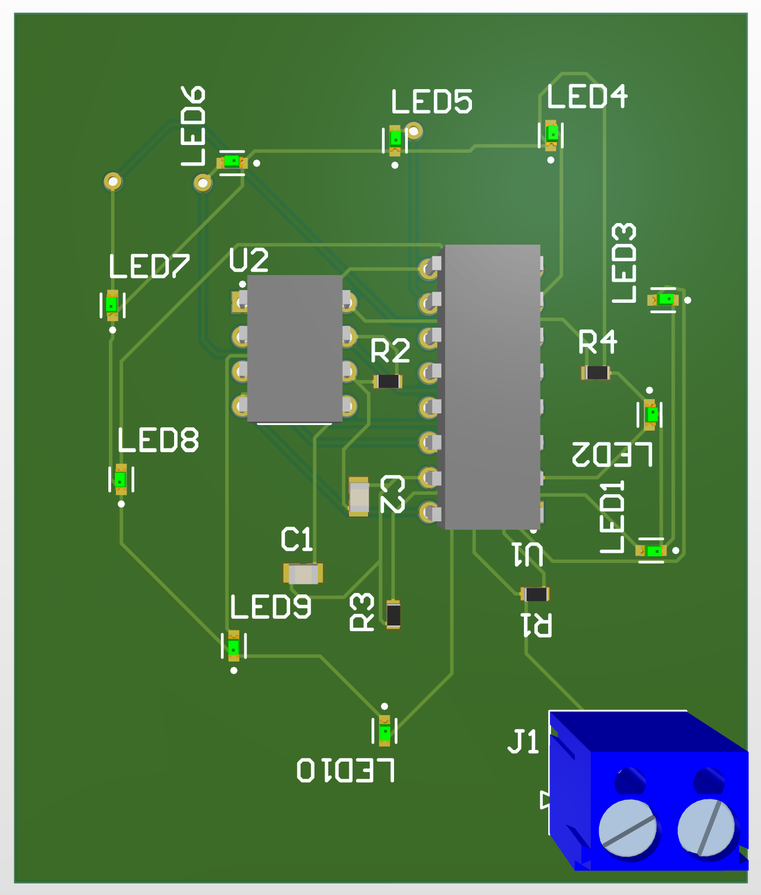</td>
<td><b>3D Bottom</b><br>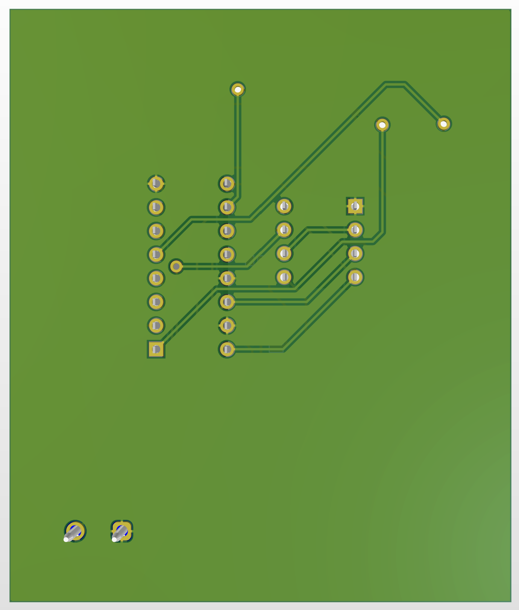</td>
</tr>
<tr>
<td><b>Gerber Preview</b><br>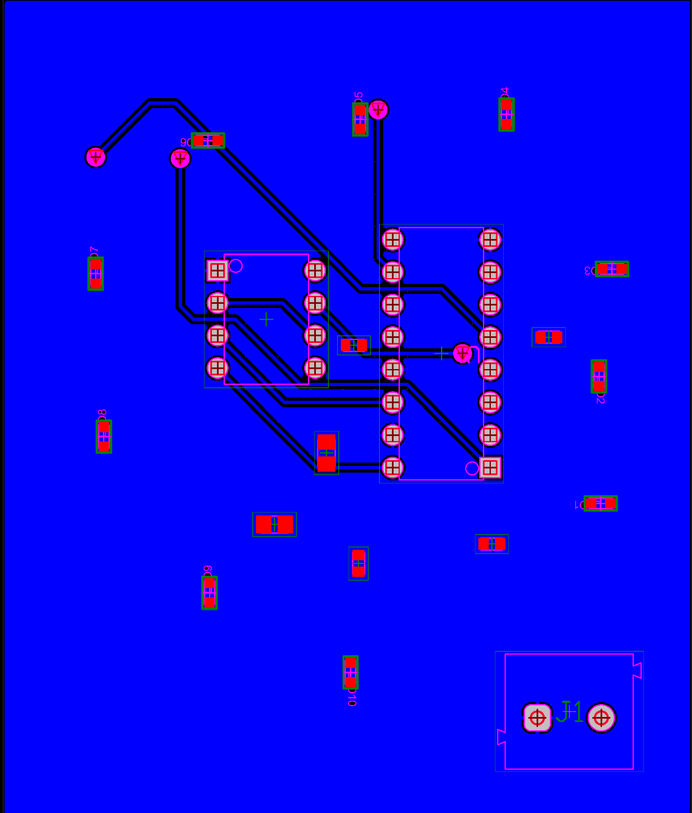</td>
<td><b>Drill Overview</b><br>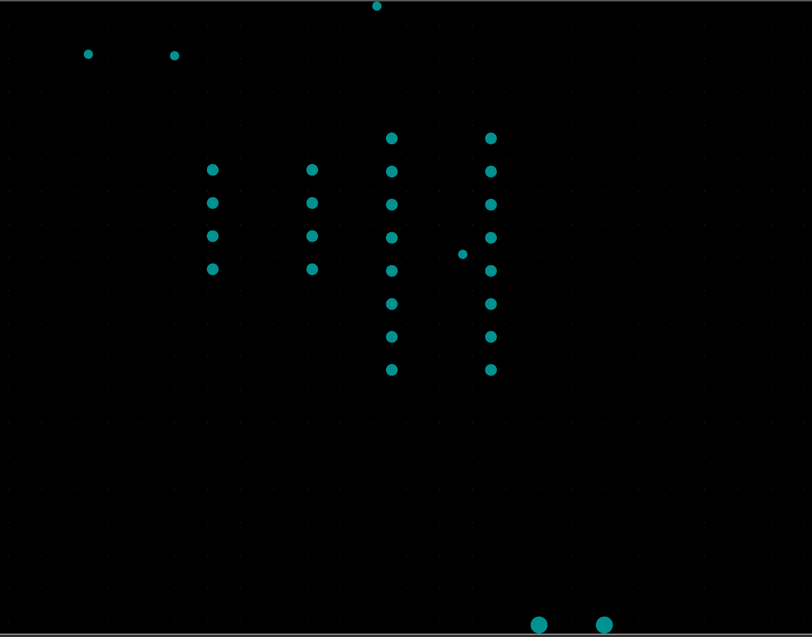</td>
</tr>
</table>

**Files:** [Schematic](Single-Layer-LED-Chaser/Schematics/LED_Chaser.SchDoc) · [PCB](Single-Layer-LED-Chaser/PCB/LED_Chaser.PcbDoc) · [Project file](Single-Layer-LED-Chaser/LED_Chaser.PrjPcb) · [BOM](Single-Layer-LED-Chaser/Outputs/BOM) · [Gerbers](Single-Layer-LED-Chaser/Outputs/Gerber) · [Schematic/PCB PDFs, DRC, drill report](Single-Layer-LED-Chaser/Outputs/Reports) · [Libraries](Single-Layer-LED-Chaser/Libraries)

---

## 2. Smart Home Automation PCB (Multi-Layer)

An ESP32-based home automation controller. The block diagram is: **Mobile App/Web → Wi-Fi (ESP32) → Relay Driver → Relay Modules → AC Load**, with manual switches wired in for physical/local control alongside app control.

**Hardware components:** ESP32-WROOM-32 microcontroller · relay modules · HLK-PM03 (AC-to-3.3V DC) power module · bridge rectifier · resistors · capacitors

### 6-Layer Stack-Up

| Layer | Purpose |
|---|---|
| Top | Components + signals |
| Inner 1 | Signal + ground |
| Inner 2 | 5V power plane |
| Inner 3 | 3.3V power plane |
| Inner 4 | Signal routing |
| Bottom | Components + signals |

Dedicated 5V/3.3V power planes isolate the two supplies, cut noise and ripple, and act as distributed capacitance against high-frequency switching noise from the ICs — plus they give lower-impedance power delivery, more routing room for the complex signal set, and better thermal/manufacturing symmetry. Routing was done **manually** (not auto-routed) specifically to preserve signal integrity across this plane stack.

- **Top layer:** ESP32, relays, and key connectors — ESP32 placed here for the best Wi-Fi signal and easy programming access; relays here for heat dissipation and physical separation from AC loads; switch/load connectors positioned for clean user-facing routing.
- **Bottom layer:** flyback diodes for the relays, the voltage regulator and filtering capacitors, pull-up resistors for the switches, and terminal blocks — kept off the top layer to reduce congestion, improve thermal spread, and simplify routing.

<table>
<tr>
<td><b>Schematic</b><br></td>
<td><b>Top Copper Layer</b><br></td>
</tr>
<tr>
<td><b>Bottom Layer</b><br>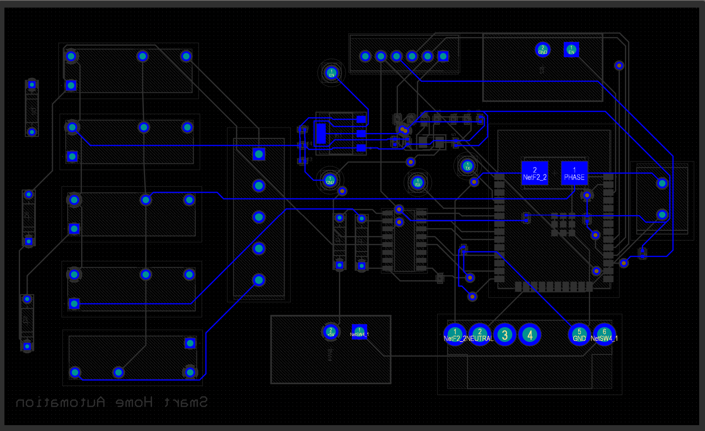</td>
<td><b>Layer Stack Manager</b><br></td>
</tr>
<tr>
<td><b>Via Types / Stack Detail</b><br>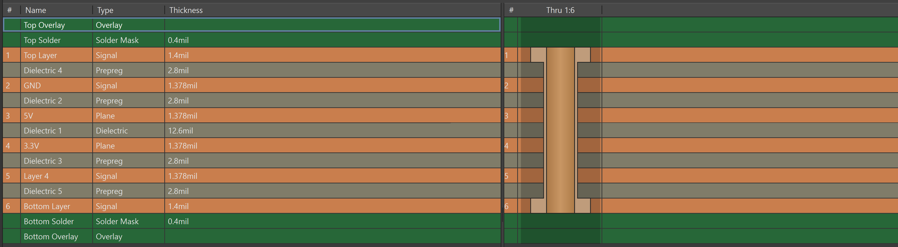</td>
<td><b>3D View</b><br>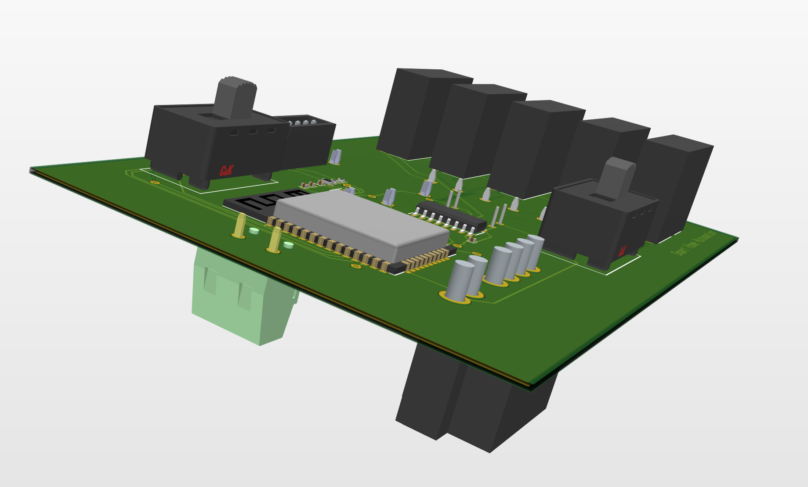</td>
</tr>
<tr>
<td><b>3D Top</b><br>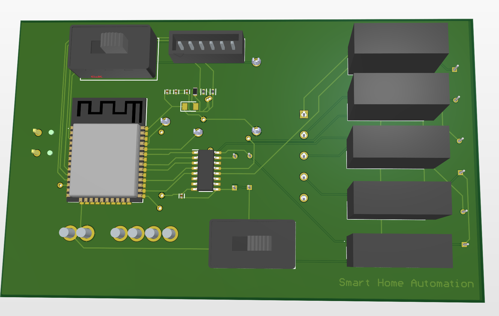</td>
<td><b>3D Bottom</b><br>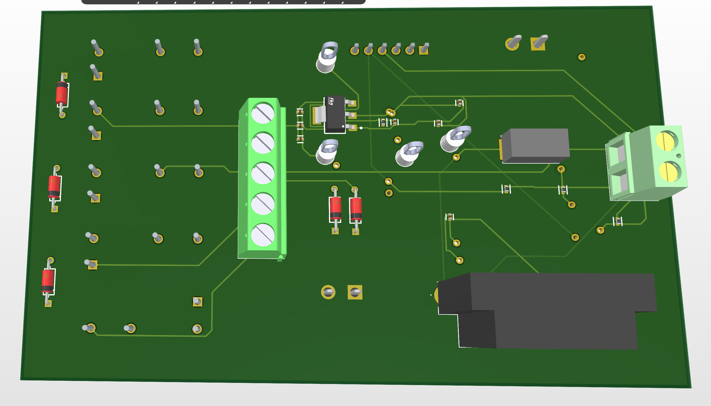</td>
</tr>
<tr>
<td><b>3D Isometric Top</b><br></td>
<td><b>3D Isometric Bottom</b><br>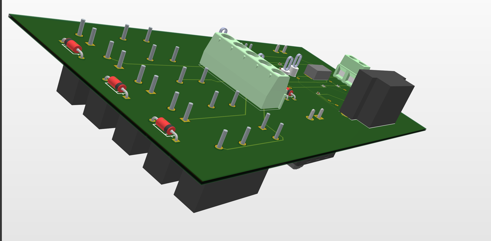</td>
</tr>
<tr>
<td><b>Gerber Preview</b><br>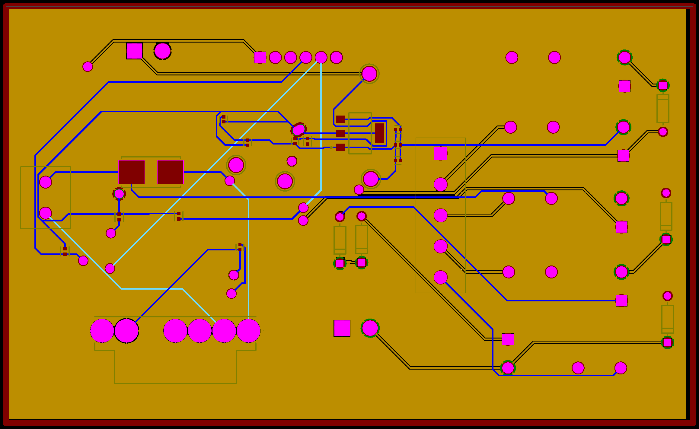</td>
<td><b>Drill Overview</b><br>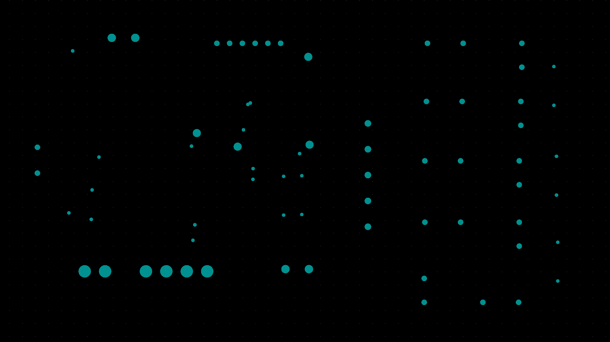</td>
</tr>
</table>

**Files:** [Schematics](Smart-Home-Control-PCB/Schematics) · [PCB](Smart-Home-Control-PCB/PCB/PCB.PcbDoc) · [Project file](Smart-Home-Control-PCB/Project/Smart_Home_Control.PrjPcb) · [BOM (BomDoc / xlsx / pdf)](Smart-Home-Control-PCB/Bill_of_Materials) · [Gerbers & drill (raw CAM output)](Smart-Home-Control-PCB/Project/Project%20Outputs%20for%20Smart_Home_Control) · [DRC report](Smart-Home-Control-PCB/Outputs/Reports/DRC_Report.pdf)

---

## Verification

Both boards were fully verified in Altium Designer before fabrication outputs were generated:

- **ERC** (Electrical Rule Check) and **DRC** (Design Rule Check) — correct connections, clearances, and design-rule compliance
- **Netlist comparison** — consistency between schematic and PCB layout
- **SPICE simulation** — validated the power-supply and relay circuits (Smart Home board)
- **3D clearance check** — confirmed no physical interference between components
- **BOM review** — checked for part availability and accuracy
- **Proteus simulation** — confirmed the LED-chase sequence works correctly (LED Chaser board)

All checks passed and both designs were approved for fabrication; manufacturing outputs (Gerbers, NC drill files, BOM, schematics, PCB layouts, 3D views) were then generated for each.

## Tools & Software

| Tool | Used for |
|---|---|
| **Altium Designer** | Schematic capture, PCB layout, routing, 3D visualization, Gerber generation |
| **Proteus** | Simulating and verifying the LED Chaser circuit |
| **Altium CAMtastic** | Reviewing/validating Gerber & CAM outputs |
| **Altium Layer Stack Manager** | Configuring the 6-layer stack-up on the Smart Home board |

## Future Scope

- Bluetooth/MQTT support for the Smart Home controller
- Sensor integration (temperature, motion)
- A polished mobile app UI for control
- Cloud-based control and analytics
- Local control via physical switches, independent of the app

## References

1. [Espressif Systems — ESP32 Datasheet](https://www.espressif.com/en/support/download/documents)
2. [Altium Designer Documentation](https://www.altium.com/documentation)
3. [IEEE Xplore — Papers on Smart Home Systems](https://ieeexplore.ieee.org/Xplore/home.jsp)
4. [Stack Overflow](https://stackoverflow.com/) / [r/embedded](https://www.reddit.com/r/embedded/) — troubleshooting resources
5. [EEVblog Forum — Altium Designer](https://www.eevblog.com/forum/altium/)
6. Simon Monk, *Make Your Own PCBs with Eagle: From Schematic Designs to Finished Boards*, McGraw-Hill Education, 2014
7. [Rui Santos — Home Automation Projects with ESP32/ESP8266](https://randomnerdtutorials.com/)
8. [Andreas Spiess — ESP32 & IoT Tutorials (YouTube)](https://www.youtube.com/c/AndreasSpiess)
9. [Espressif — ESP-IDF Programming Guide](https://docs.espressif.com/projects/esp-idf/en/latest/esp32/)
10. [Neil Kolban — Kolban's Book on ESP32](https://leanpub.com/kolban-ESP32)

## Authors

**B. Praneeth Reddy** · **G. Rohit Reddy** · **C. Vivek** 

<div align="center">

Built using Altium Designer

</div>
